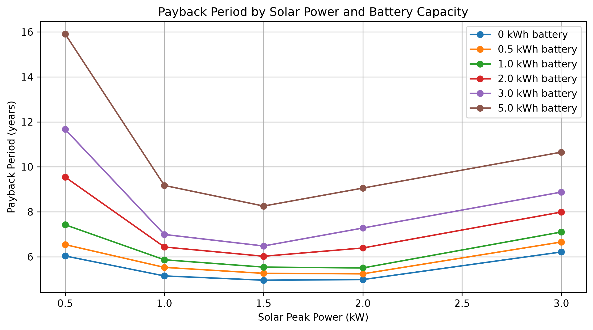
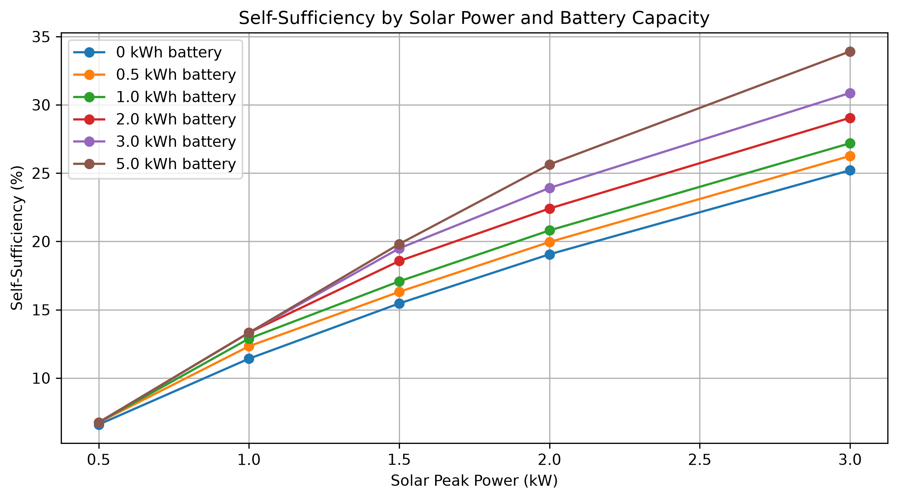
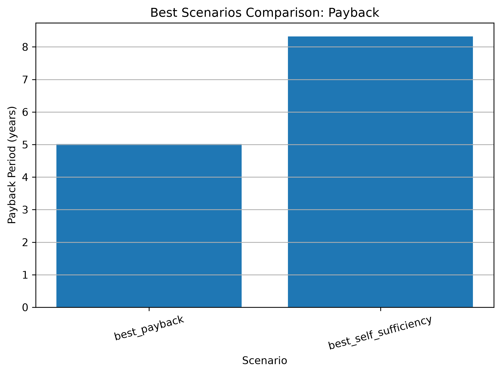
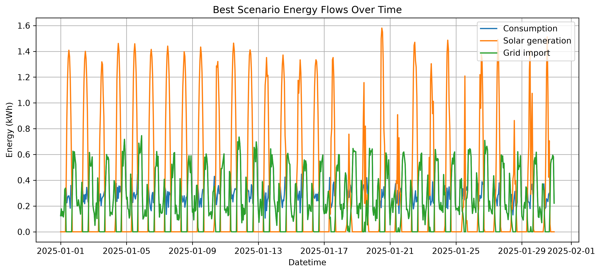
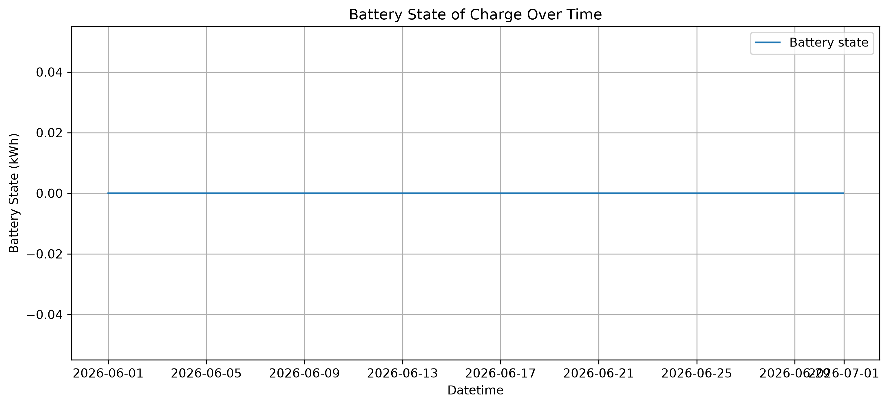
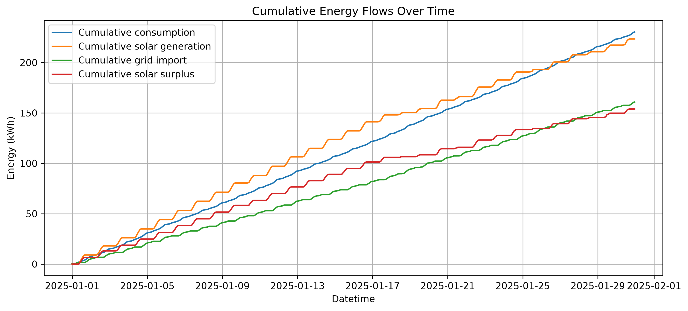
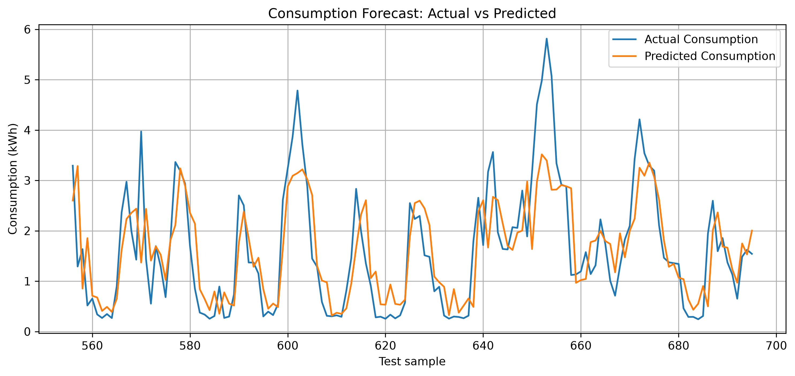
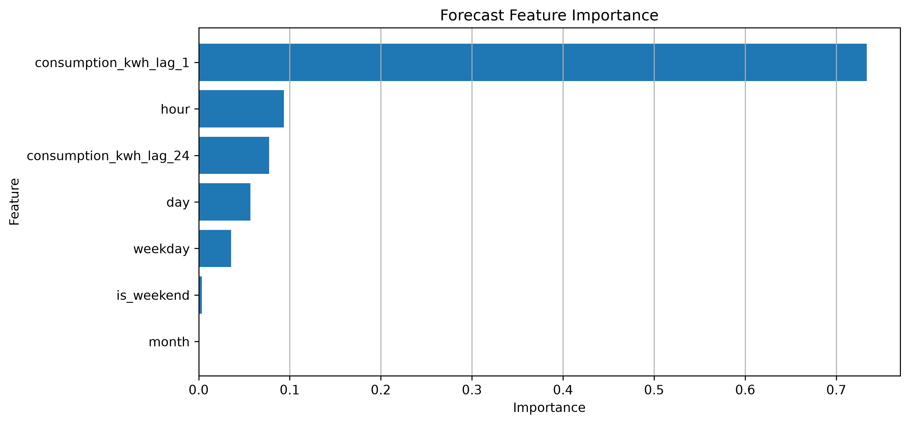

# Electricity Consumption Solar Optimizer


A Python-based residential energy optimization project that combines electricity consumption analysis, PVGIS solar generation data, battery simulation, economic optimization and machine learning-based consumption forecasting.

The project estimates how different photovoltaic and battery configurations affect:

- Grid electricity import
- Solar self-consumption
- Solar surplus
- Self-sufficiency
- Annual savings
- Investment cost
- Simple payback period
- Hourly consumption forecasting accuracy

This repository is designed as a data science and energy analytics portfolio project.

---

## Project overview

The project simulates the energy behavior of a household with photovoltaic generation and optional battery storage.

It uses:

- Hourly household electricity consumption data
- PVGIS hourly solar generation data for Linares, Spain
- A battery storage model with efficiency and power limits
- Economic assumptions for electricity price, surplus compensation and installation costs
- Grid search optimization over multiple solar and battery sizes
- Machine learning forecasting for hourly electricity consumption
- Unit tests for core calculation modules

The current workflow is:

```text
consumption data
      ↓
PVGIS solar generation
      ↓
solar self-consumption simulation
      ↓
battery simulation
      ↓
economic optimization
      ↓
best scenario selection
      ↓
forecasting and interpretation
      ↓
reports, plots and notebooks
```

---

## Main features

- Hourly electricity consumption analysis
- Synthetic 30-day consumption dataset generation
- PVGIS solar data download and loading
- Solar production scaling for different PV peak powers
- Self-consumption and grid import simulation
- Battery charge/discharge simulation
- Battery efficiency and charge/discharge power limits
- Solar surplus compensation
- Economic grid search over solar and battery sizes
- Payback period calculation
- Best scenario selection by economic payback
- Best scenario selection by self-sufficiency
- Forecasting of hourly consumption using Machine Learning
- Random Forest regression model
- MAE and RMSE forecast evaluation
- Feature importance analysis
- Automatic report and plot generation
- Unit tests with pytest
- Jupyter notebooks for analysis and presentation

---

## Example results

The exact results can change depending on the generated synthetic consumption data and the selected economic assumptions.

Example output from the optimization workflow:

```text
Best scenario by payback:
Solar peak power: 1.50 kW
Battery capacity: 0.00 kWh
Investment cost: 2150.00 EUR
Annual savings: 431.73 EUR/year
Payback: 4.98 years
Self-sufficiency: 48.83%

Best scenario by self-sufficiency:
Solar peak power: 1.50 kW
Battery capacity: 5.00 kWh
Investment cost: 4650.00 EUR
Annual savings: 563.25 EUR/year
Payback: 8.26 years
Self-sufficiency: 99.46%
```

The project distinguishes between the economically optimal scenario and the energy optimal scenario. In many cases, the scenario with the highest self-sufficiency is not the one with the shortest payback period.

---

## Visual results

### Payback grid search



### Self-sufficiency grid search



### Best scenarios comparison



### Best scenario energy flows



### Battery state of charge



### Cumulative energy flows



### Consumption forecast



### Forecast feature importance



---

## Consumption forecasting

The project includes a first machine learning module for hourly electricity consumption forecasting.

The forecasting model uses:

- Temporal features: hour, day, month, weekday and weekend indicator
- Lag-based features: previous hour consumption and previous day same-hour consumption
- A Random Forest regression model
- Chronological train/test split
- MAE and RMSE evaluation metrics
- Feature importance analysis

The goal is to estimate future household electricity consumption from historical hourly data.

Current example results on the synthetic 30-day dataset:

```text
MAE: 0.0418 kWh
RMSE: 0.0521 kWh
```

This means that the average hourly prediction error is around 42 Wh.

The feature importance analysis shows that the model relies mainly on the previous day's consumption at the same hour and the hour of the day. This is consistent with the synthetic dataset, which contains a strong repeated daily consumption pattern.

---

## Project structure

```text
electricity-consumption-solar-optimizer/
│
├── data/
│   ├── raw/
│   │   └── pvgis_hourly_linares_1kw_2020.csv
│   ├── processed/
│   └── simulated/
│       └── synthetic_consumption_30_days.csv
│
├── images/
│   ├── main_payback_grid_search.png
│   ├── main_self_sufficiency_grid_search.png
│   ├── best_scenarios_comparison.png
│   ├── best_scenario_timeseries.png
│   ├── best_scenario_battery_state.png
│   ├── best_scenario_cumulative_energy.png
│   ├── consumption_forecast_actual_vs_predicted.png
│   └── forecast_feature_importance.png
│
├── reports/
│   ├── grid_search_results.csv
│   ├── best_scenarios.csv
│   ├── best_scenario_timeseries.csv
│   ├── summary.txt
│   └── outputs_index.md
│
├── notebooks/
│   ├── 01_exploratory_analysis.ipynb
│   ├── 02_solar_battery_simulation.ipynb
│   ├── 03_optimization_analysis.ipynb
│   └── 04_consumption_forecasting.ipynb
│
├── scripts/
│   ├── download_pvgis_data.py
│   ├── generate_synthetic_consumption.py
│   ├── test_pvgis_generation_match.py
│   ├── test_pvgis_loader.py
│   └── test_forecasting.py
│
├── tests/
│   ├── test_economics.py
│   ├── test_battery.py
│   └── test_solar_data_loader.py
│
├── src/
│   ├── battery.py
│   ├── config.py
│   ├── data_loader.py
│   ├── economics.py
│   ├── forecasting.py
│   ├── main.py
│   ├── optimization.py
│   ├── scenarios.py
│   ├── solar.py
│   ├── solar_data_loader.py
│   ├── tariff.py
│   └── visualization.py
│
├── requirements.txt
├── .gitignore
└── README.md
```

---

## Main modules

### `data_loader.py`

Loads hourly electricity consumption data from CSV files and creates basic time features.

Expected consumption input format:

```csv
datetime,consumption_kwh
2025-01-01 00:00:00,0.18
2025-01-01 01:00:00,0.15
```

### `solar_data_loader.py`

Loads PVGIS hourly photovoltaic generation data.

The PVGIS file is downloaded for a reference 1 kW photovoltaic system and then scaled linearly for different PV system sizes.

Important PVGIS columns:

```text
time  → timestamp from PVGIS
P     → estimated PV power output in W
```

The project converts:

```text
P / 1000 → solar_generation_1kw_kwh
```

and matches PVGIS solar generation to the consumption timestamps by month, day and hour.

### `solar.py`

Contains the basic solar self-consumption logic.

It computes:

- Self-consumed solar energy
- Grid import
- Solar surplus

### `battery.py`

Simulates battery behavior hour by hour.

The battery model includes:

- Battery capacity
- Battery efficiency
- Maximum charge power
- Maximum discharge power
- Initial state of charge
- Hourly charge/discharge behavior
- Remaining grid import
- Remaining solar surplus

### `economics.py`

Contains economic calculation functions:

- Grid electricity cost
- Net cost after surplus compensation
- Solar installation cost
- Battery installation cost
- Total investment cost
- Simple payback period

### `optimization.py`

Runs the economic grid search over multiple combinations of:

- Solar peak power
- Battery capacity

It produces a table containing:

- Investment cost
- Period cost
- Annual cost
- Period savings
- Annual savings
- Payback period
- Grid import
- Solar surplus
- Self-sufficiency

It also selects:

- Best scenario by minimum payback period
- Best scenario by maximum self-sufficiency

### `forecasting.py`

Creates forecasting features, trains a Random Forest model, evaluates predictions and extracts feature importance.

The forecasting module includes:

- Time feature creation
- Lag feature creation
- Chronological train/test split
- Random Forest training
- MAE and RMSE evaluation
- Actual vs predicted results table
- Feature importance extraction

### `visualization.py`

Generates plots for:

- Payback grid search
- Self-sufficiency grid search
- Best scenario comparison
- Best scenario energy flows
- Battery state of charge
- Cumulative energy flows
- Forecast actual vs predicted
- Forecast feature importance

---

## Notebooks

### `01_exploratory_analysis.ipynb`

Exploratory analysis of the synthetic household consumption dataset.

Includes:

- Hourly consumption visualization
- Daily consumption analysis
- Average consumption by hour
- Weekday/weekend patterns

### `02_solar_battery_simulation.ipynb`

Explains and visualizes the solar and battery simulation.

Includes:

- PVGIS solar generation loading
- Solar generation matching to consumption timestamps
- Self-consumption simulation
- Battery simulation
- Grid import and solar surplus visualization
- Battery state of charge visualization

### `03_optimization_analysis.ipynb`

Analyzes the grid search optimization results.

Includes:

- Payback comparison
- Self-sufficiency comparison
- Best scenario by payback
- Best scenario by self-sufficiency
- Economic vs energy optimal scenario comparison

### `04_consumption_forecasting.ipynb`

Machine learning notebook for hourly consumption forecasting.

Includes:

- Forecasting problem definition
- Feature creation
- Chronological train/test split
- Random Forest regression model
- MAE and RMSE metrics
- Actual vs predicted plot
- Feature importance analysis
- Interpretation of model behavior

---

## Scripts

### `generate_synthetic_consumption.py`

Generates a synthetic 30-day hourly electricity consumption dataset.

Run with:

```bash
python scripts/generate_synthetic_consumption.py
```

### `download_pvgis_data.py`

Downloads hourly PVGIS solar generation data for Linares, Spain.

Run with:

```bash
python scripts/download_pvgis_data.py
```

### `test_pvgis_loader.py`

Loads the PVGIS CSV file and verifies the basic format and yearly generation.

Run with:

```bash
python scripts/test_pvgis_loader.py
```

### `test_pvgis_generation_match.py`

Matches PVGIS solar generation to the consumption timestamps.

Run with:

```bash
python scripts/test_pvgis_generation_match.py
```

### `test_forecasting.py`

Runs the consumption forecasting pipeline and generates forecast plots.

Run with:

```bash
python scripts/test_forecasting.py
```

Generated forecast plots:

```text
images/consumption_forecast_actual_vs_predicted.png
images/forecast_feature_importance.png
```

---

## Installation

Clone the repository:

```bash
git clone https://github.com/your-username/electricity-consumption-solar-optimizer.git
cd electricity-consumption-solar-optimizer
```

Create and activate a virtual environment:

```bash
python3 -m venv venv
source venv/bin/activate
```

Install dependencies:

```bash
pip install -r requirements.txt
```

---

## How to run

From the project root, run the full workflow:

```bash
python scripts/generate_synthetic_consumption.py
python scripts/download_pvgis_data.py
python src/main.py
```

This generates:

```text
data/simulated/synthetic_consumption_30_days.csv
data/raw/pvgis_hourly_linares_1kw_2020.csv
reports/
images/
```

To run the forecasting workflow:

```bash
python scripts/test_forecasting.py
```

---

## Tests

The project includes unit tests for the main calculation modules:

- Economic calculations
- Battery simulation
- PVGIS solar data loading and timestamp matching

Run the full test suite with:

```bash
python -m pytest
```

Current test files:

```text
tests/test_economics.py
tests/test_battery.py
tests/test_solar_data_loader.py
```

These tests help verify that the core simulation and optimization components behave as expected.

---

## Generated reports

After running `src/main.py`, the project creates:

```text
reports/grid_search_results.csv
reports/best_scenarios.csv
reports/best_scenario_timeseries.csv
reports/summary.txt
reports/outputs_index.md
```

### `grid_search_results.csv`

Full grid search results. Each row represents one combination of solar peak power and battery capacity.

### `best_scenarios.csv`

Summary of the two selected optimal scenarios:

- Best by payback
- Best by self-sufficiency

### `best_scenario_timeseries.csv`

Hourly energy flow table for the best economic scenario.

Includes:

- Consumption
- Solar generation
- Self-consumption
- Battery charge
- Battery discharge
- Grid import
- Solar surplus
- Battery state of charge

### `summary.txt`

Readable text summary of the best scenarios.

### `outputs_index.md`

Index describing all generated project outputs.

---

## Solar data source

The solar generation data comes from PVGIS, using hourly photovoltaic generation estimates for Linares, Spain.

The downloaded file represents a reference 1 kW PV system. The project scales this profile to simulate different installed PV capacities.

For example:

```text
0.5 kW system → PVGIS 1 kW profile × 0.5
1.5 kW system → PVGIS 1 kW profile × 1.5
3.0 kW system → PVGIS 1 kW profile × 3.0
```

This is more realistic than a manually defined synthetic solar curve, because it uses location-specific hourly solar generation behavior.

---

## Current assumptions

The current version uses simplified assumptions:

- Synthetic household consumption dataset
- PVGIS solar generation for a reference 1 kW PV system
- Linear scaling of PVGIS generation for different PV sizes
- Constant electricity import price
- Constant surplus compensation price
- Simple payback period
- No panel degradation
- No battery degradation
- No taxes or fixed electricity bill terms
- No seasonal consumption variation beyond the available dataset
- Machine Learning model trained on synthetic data

These assumptions make the model easier to understand and extend.

---

## Future improvements

Possible next steps:

- Use real household hourly consumption data
- Add realistic Spanish electricity tariff periods
- Include fixed power charges and taxes
- Add battery degradation and replacement costs
- Add PV panel degradation
- Add seasonal consumption datasets
- Include weather variables in the forecasting model
- Compare several forecasting models
- Use real future consumption forecasts inside the optimization workflow
- Add YAML configuration files
- Add command-line interface
- Add Streamlit dashboard
- Add more unit tests
- Add CI with GitHub Actions

---

## Technologies used

- Python
- pandas
- NumPy
- matplotlib
- scikit-learn
- requests
- pytest
- Jupyter Notebook
- PVGIS API

---

## Project status

Current status:

```text
Energy simulation          complete
Battery simulation         complete
PVGIS integration          complete
Economic optimization      complete
Report generation          complete
Visualization outputs      complete
Unit tests                 complete
Forecasting baseline       complete
Feature importance         complete
Real consumption data      pending
Advanced tariffs           pending
Dashboard / CLI            pending
```

---

## Author

Developed as a data science, energy analytics and Python portfolio project.